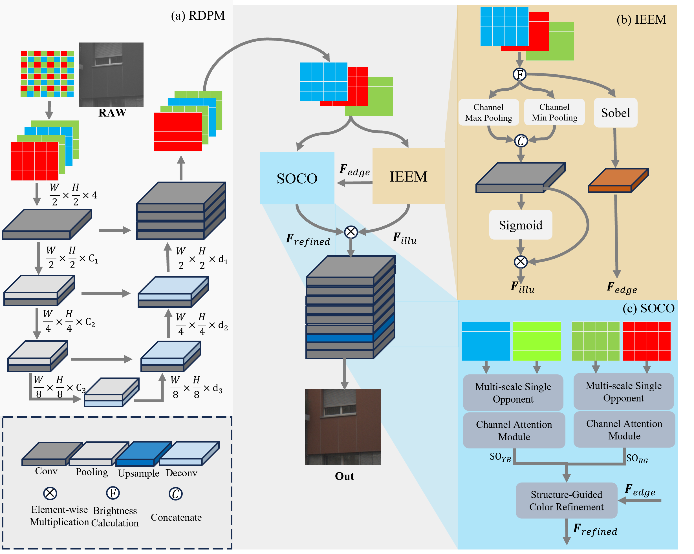

# MSOCISP
This repository hosts the official open-source code for the paper **"A Bio-Inspired Framework for Lightweight RAW-to-sRGB Mapping and Color Optimization"**.
The model architecture is visualized in the figure below.

## Dataset
Our experiments are implemented on two public datasets:
- [ZRR](https://github.com/cszhilu1998/RAW-to-sRGB)
- [MAI](https://github.com/RenYangSCU/ISPDiffuser)

## Pre-trained Model
The pre-trained model weights are stored in the `./premodel` directory.

## Acknowledgments
Part of this code is developed based on [ISPDiffuser](https://github.com/RenYangSCU/ISPDiffuser). We greatly appreciate the authors for their outstanding work.