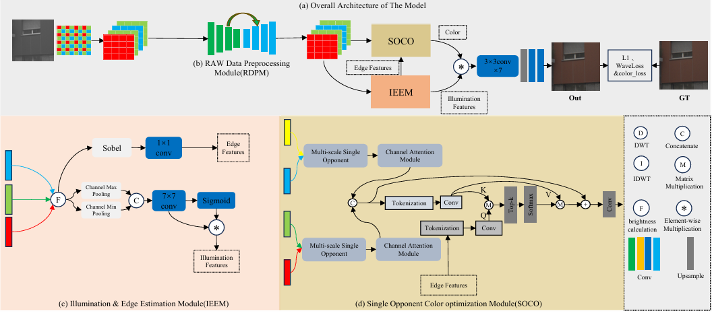

# MSOCISP

This code is the publicly available code from the paper "Lightweight RAW-to-sRGB Mapping Model Toward Color Optimization". The model structure is shown in the figure.

#dataset

Dataset include [ZRR](https://github.com/cszhilu1998/RAW-to-sRGB)) and [MAI](https://github.com/RenYangSCU/ISPDiffuser?tab=readme-ov-file).
